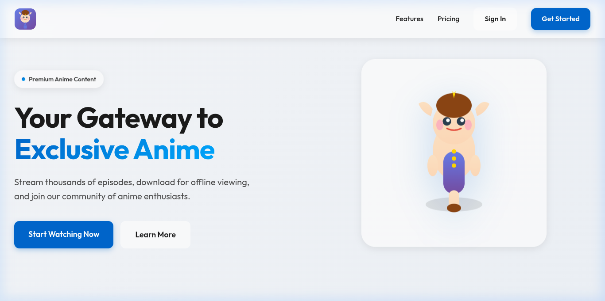
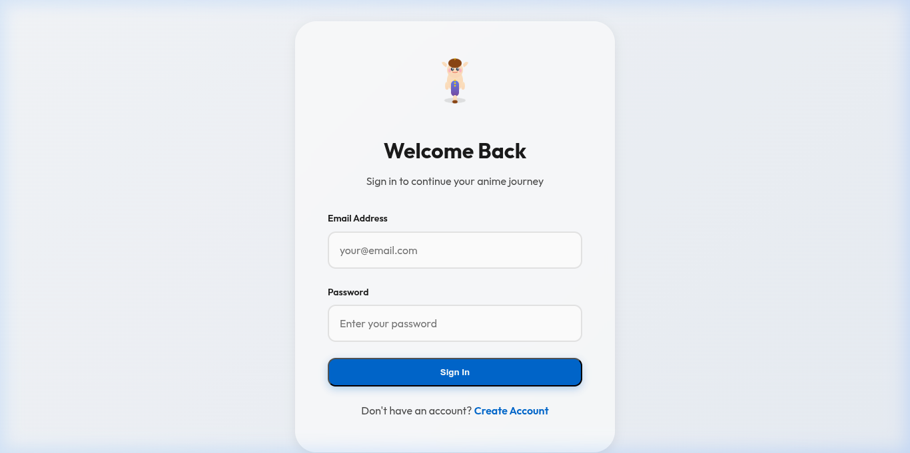
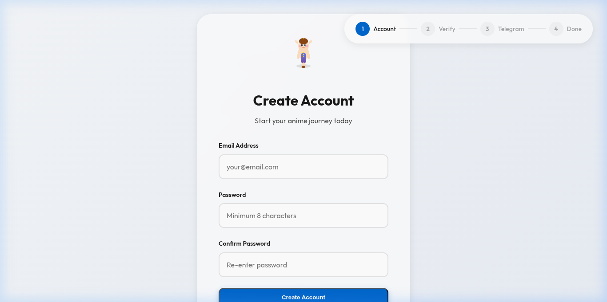
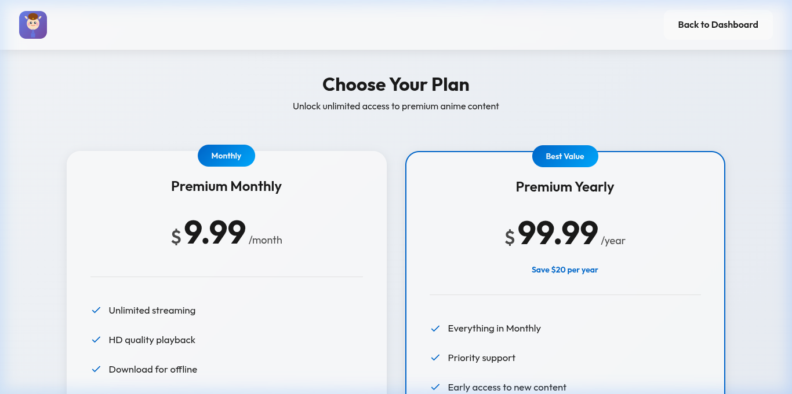

# Anime Platform — Стриминговая платформа с премиум-подпиской

Веб-приложение премиум-класса для стриминга и просмотра аниме, выполненное в изысканном стиле Glassmorphism (эффект матового стекла от Apple). Проект включает полноценный Express бэкенд, базу данных PostgreSQL, многошаговую форму регистрации с верификацией по почте, систему сессий по JWT и проверку подписки на Telegram-канал перед открытием доступа к файлам.

---

## 🎨 Скриншоты интерфейса

> [!NOTE]
> Замените плейсхолдеры реальными скриншотами интерфейса после развертывания проекта.

| Раздел / Экран | Превью |
|---|---|
| **Главный лендинг** (Промо-секция в стиле матового стекла) |  |
| **Панель пользователя (Dashboard)** (Сетка релизов и плеер) |  |
| **Регистрация** (Пошаговый процесс с подтверждением почты) |  |
| **Проверка Telegram** (Интеграция с Bot API для верификации) |  |

---

## 🚀 Основные возможности

*   **🔒 Безопасная аутентификация**: Регистрация по почте и паролю с генерацией и сверкой 6-значных кодов верификации через `nodemailer`.
*   **🤖 Проверка подписки в Telegram**: Интеграция с Telegram Bot API. Доступ к плееру блокируется до тех пор, пока пользователь не подпишется на указанный Telegram-канал.
*   **💻 Защита сессий и отпечатков (Fingerprinting)**:
    *   Генерация JWT-токенов для авторизованных сессий.
    *   Запись цифрового отпечатка браузера (Browser Fingerprinting) и обнаружение VPN/прокси через интеграцию с IPInfo API для предотвращения мультиаккаунтинга.
*   **📂 Интерактивный файловый менеджер**: Удобный проводник по сериям и сезонам с поддержкой потокового HLS-видео прямо в браузере во встроенном модальном плеере.
*   **💳 Интеграция оплаты (Шаблон)**: Реализована логика биллинга и проверки статуса платежей (с возможностью легкого подключения Stripe, PayPal или ЮKassa).
*   **🎨 Премиальный дизайн**: Сверхсовременный интерфейс с использованием CSS-свойств `backdrop-filter: blur()`, гармоничной палитрой синего акцента `#0066CC`, фирменными векторными маскотами (Elf) и шрифтом Outfit.

---

## 🛠️ Технологический стек

### Бэкенд
*   Node.js (Express)
*   PostgreSQL (хранение данных о пользователях, сессиях и медиафайлах)
*   JWT (JSON Web Tokens) для авторизации
*   Nodemailer (отправка писем с кодами подтверждения)
*   Telegram Bot API (проверка членства в канале)
*   IPInfo API (определение ГЕО и детекция VPN)

### Фронтенд
*   Чистый HTML5 и CSS3 (акцент на Glassmorphism)
*   Ванильный JavaScript (модульная архитектура, без тяжелых фреймворков)
*   Шрифтовое семейство Outfit (Apple-style)
*   Полностью адаптивная верстка (мобильные телефоны, планшеты, ПК)

---

## ⚙️ Установка и настройка

### 1. Подготовка базы данных (PostgreSQL)

Создайте базу данных и примените схему:

```bash
psql -U postgres
CREATE DATABASE anime_platform;
\c anime_platform
\i database/schema.sql
```

### 2. Настройка бэкенда

Перейдите в папку `backend`, установите зависимости и скопируйте шаблон окружения:

```bash
cd backend
npm install
cp .env.example .env
```

Отредактируйте созданный файл `.env`, добавив свои данные:
*   URL базы данных (`DATABASE_URL`)
*   Секретный ключ JWT (`JWT_SECRET`)
*   Токен Telegram-бота и ID канала (`TELEGRAM_BOT_TOKEN`, `TELEGRAM_CHANNEL_ID`)
*   Данные SMTP для отправки писем (`SMTP_HOST`, `SMTP_PORT`, `SMTP_USER`, `SMTP_PASS`)
*   Токен IPInfo (`IPINFO_TOKEN`)

Запустите бэкенд-сервер:
```bash
npm start
```
Сервер запустится в режиме разработчика на порту, указанном в `.env` (обычно 5000).

### 3. Запуск фронтенда

Фронтенд представляет собой статические файлы. Для их запуска локально используйте любой веб-сервер, например:

```bash
cd frontend
python -m http.server 8080
```
Или используйте расширение *Live Server* в VS Code. Приложение будет доступно по адресу `http://localhost:8080`.

> [!IMPORTANT]
> Перед запуском убедитесь, что константа `API_BASE` в JavaScript-файлах фронтенда (`frontend/js/`) указывает на ваш адрес бэкенда (например, `http://localhost:5000`).

---

## 🤖 Настройка сервисов

### Telegram-бот для проверки подписки
1.  Создайте нового бота через [@BotFather](https://t.me/BotFather) и скопируйте токен.
2.  Создайте публичный или приватный Telegram-канал.
3.  Добавьте бота в этот канал как администратора с правами на приглашение/просмотр пользователей.
4.  Укажите ID канала в `.env` бэкенда (для публичных каналов — `@имя_канала`, для приватных — числовой ID, начинающийся с `-100`).

### Настройка SMTP (Email)
Для отправки писем верификации через Gmail:
1.  Включите двухфакторную аутентификацию (2FA) в Google-аккаунте.
2.  Перейдите в раздел «Пароли приложений», сгенерируйте новый пароль для бэкенда.
3.  Используйте ваш email в качестве `SMTP_USER` и сгенерированный 16-значный пароль в качестве `SMTP_PASS`.

---

## 📁 Структура папок

```text
anime-platform/
├── backend/                  # Сервер Express.js
│   ├── src/
│   │   ├── config/           # Конфигурация PostgreSQL
│   │   ├── middleware/       # Проверка авторизации (JWT)
│   │   ├── routes/           # Роуты (auth, subscription, files)
│   │   └── services/         # Сервисы (отправка писем, Telegram-проверки, IP-детекция)
│   └── package.json
├── database/                 # База данных
│   └── schema.sql            # Скрипт инициализации таблиц PostgreSQL
├── frontend/                 # Клиентская часть (статические файлы)
│   ├── css/                  # Стили страниц (Glassmorphism, формы, плеер)
│   ├── js/                   # Скрипты авторизации, оплаты и дашборда
│   ├── images/               # Графика и маскоты (Elf)
│   └── *.html                # HTML-страницы платформы
└── README.md
```

---

## 📄 Лицензия
Данное программное обеспечение является приватной разработкой. Все права сохранены.
